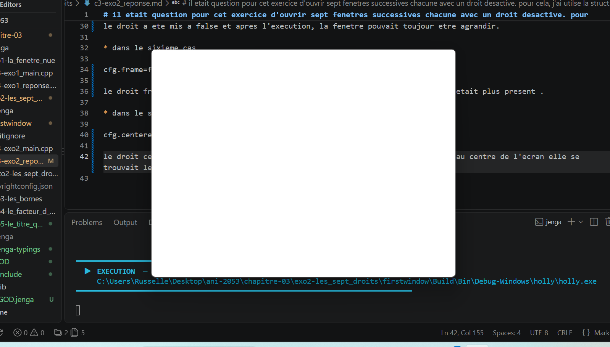
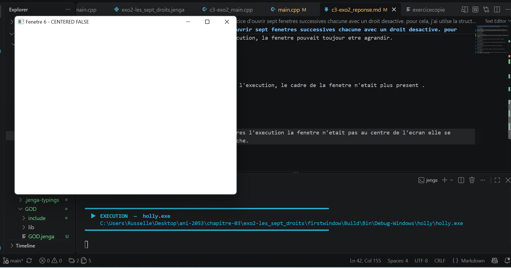

# il etait question pour cet exercice d'ouvrir sept fenetres successives chacune avec un droit desactive. pour cela, j'ai utilse la structure de base d'une creation de fenetre donne dans le chapitre et a desactive un droit dans chacune des fenetres crees afin d'observer comment la fenetre se comportera.

* dans le premier cas

cfg.minimizable=false 
j'ai mis ce droit a false et lorsque la fenetre c'est ouverte,aucun effet visible n'a ete constate car j'ai essayer de la reduire et j'y suis parvenue chose qui n'est pas normale vue qu'elle a pris la valeur false(minimizable). cependant, notons qu'il n'est pas oblige de mettre les autres droits a true car de base ils le sont deja dans NkWindowConfig. 

* dans le second cas

cfg.resizable=false

j'ai mis ce droit a "false" et
 apres l'execution de mon code et l'ouverture  de la fenetre, aucun effet visible n'a ete constate car j'ai tirer les bords et les coins de la fenetre pour l'agrandir et reduire et elle s'est agrandir et c'est reduire chose anormale. 
* dans le troisieme cas

cfg.movable=false

pour ce cas j'ai essaye de deplacer ma fenetre et pourtant j'arrive a la deplacer. chose anormale

* dans le quatrieme  cas

cfg.closable=false

 ici, lorsque j'ai fermer ma fenetre, elle s'est ferme normalement pourtant la propriete etait a false.

* dans le cinquieme cas

cfg.maximizable=false

le droit a ete mis a false et apres l'execution, la fenetre pouvait toujour etre agrandir.

* dans le sixieme cas

cfg.frame=false

le droit frame a ete mis a false at apres l'execution, le cadre de la fenetre n'etait plus present. voici ce que cela m'a afficher 

* dans le septieme cas

cfg.centered=false

le droit centered a ete mis a false et apres l'execution la fenetre n'etait pas au centre de l'ecran elle se trouvait legerement au coin superieur gauche. voici ce qui c'est affiche 

voici le resultat du terminale:

PS C:\Users\Russelle\Desktop\ani-2053\chapitre-03\exo2-les_sept_droits\firstwindow> jenga build            

╔══════════════════════════════════════════════════════════════════╗
║                                                                  ║
║                ██╗███████╗███╗   ██╗ ██████╗  █████╗             ║
║                ██║██╔════╝████╗  ██║██╔════╝ ██╔══██╗            ║
║                ██║█████╗  ██╔██╗ ██║██║  ███╗███████║            ║
║           ██   ██║██╔══╝  ██║╚██╗██║██║   ██║██╔══██║            ║
║           ╚█████╔╝███████╗██║ ╚████║╚██████╔╝██║  ██║            ║
║            ╚════╝ ╚══════╝╚═╝  ╚═══╝ ╚═════╝ ╚═╝  ╚═╝            ║
║                                                                  ║
║             Multi-platform C/C++ Build System v2.8.1             ║
║                                                                  ║
╚══════════════════════════════════════════════════════════════════╝

Loading workspace...

Configuration: Debug
Target:        Windows x86_64
Toolchain:     clang-mingw

Build Order (1 projects):
  1. holly [CONSOLE_APP]

╔══════════════════════════════════════════════════════════════════════════════════════════════╗
║  Project: holly                                                           Kind: CONSOLE_APP  ║
╚══════════════════════════════════════════════════════════════════════════════════════════════╝

ℹ Found 1 source file(s)
✓ All files up to date

┌──────────────────────────────────────────────────────────────────────────────────────────────┐
│  ✓ Build Successful                                                             Time: 0.10s  │
└──────────────────────────────────────────────────────────────────────────────────────────────┘

════════════════════════════════════════════════════════════════════════════════
                                BUILD COMPLETED                                 
════════════════════════════════════════════════════════════════════════════════
Projects Built:  1/1
Time:           0.10s
Status:         ✓ SUCCESS
════════════════════════════════════════════════════════════════════════════════

PS C:\Users\Russelle\Desktop\ani-2053\chapitre-03\exo2-les_sept_droits\firstwindow> jenga run              

╔══════════════════════════════════════════════════════════════════╗
║                                                                  ║
║                ██╗███████╗███╗   ██╗ ██████╗  █████╗             ║
║                ██║██╔════╝████╗  ██║██╔════╝ ██╔══██╗            ║
║                ██║█████╗  ██╔██╗ ██║██║  ███╗███████║            ║
║           ██   ██║██╔══╝  ██║╚██╗██║██║   ██║██╔══██║            ║
║           ╚█████╔╝███████╗██║ ╚████║╚██████╔╝██║  ██║            ║
║            ╚════╝ ╚══════╝╚═╝  ╚═══╝ ╚═════╝ ╚═╝  ╚═╝            ║
║                                                                  ║
║             Multi-platform C/C++ Build System v2.8.1             ║
║                                                                  ║
╚══════════════════════════════════════════════════════════════════╝

━━━━━━━━━━━━━━━━━━━━━━━━━━━━━━━━━━━━━━━━━━━━━━━━━━━━━━━━━━━━━━━━━━━━━━━━━━━━━━━━
  ▶  EXECUTION  —  holly.exe
     C:\Users\Russelle\Desktop\ani-2053\chapitre-03\exo2-les_sept_droits\firstwindow\Build\Bin\Debug-Windows\holly\holly.exe
━━━━━━━━━━━━━━━━━━━━━━━━━━━━━━━━━━━━━━━━━━━━━━━━━━━━━━━━━━━━━━━━━━━━━━━━━━━━━━━━

━━━━━━━━━━━━━━━━━━━━━━━━━━━━━━━━━━━━━━━━━━━━━━━━━━━━━━━━━━━━━━━━━━━━━━━━━━━━━━━━
  ◀  FIN D'EXECUTION  —  termine normalement  (96.09s)
━━━━━━━━━━━━━━━━━━━━━━━━━━━━━━━━━━━━━━━━━━━━━━━━━━━━━━━━━━━━━━━━━━━━━━━━━━━━━━━━
